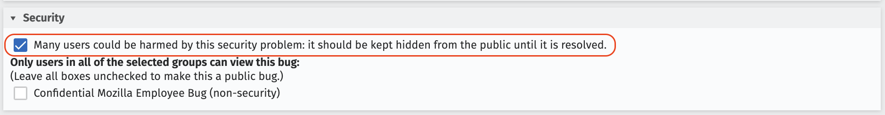

# Sourcemap Security Policy

Mozilla takes the security of our software seriously. If you believe you have found a security
vulnerability in the [source-map](https://github.com/mozilla/source-map) library, please report it to us as described below.

## Report a security bug!

Please report source-map security vulnerabilities at [bugzilla.mozilla.org](https://bugzilla.mozilla.org/enter_bug.cgi?format=__default__&product=DevTools&short_desc=[source-map%20security]) and make sure that the
checkbox in the "Security" section is checked so the required access controls are automatically configured:

## Bounty program?

There is not a bug bounty program for this library ([source-map](https://github.com/mozilla/source-map)) as a whole, but security
vulnerabilities may be eligible for a bug bounty if they can be exploited as used by Firefox.
Please see the [Firefox bug bounty program](https://www.mozilla.org/en-US/security/client-bug-bounty/) for more details and how to submit bugs to that program.

## I have a question! Who can help?

Questions regarding security bugs or our bounty programs can be directed to security@mozilla.com.
An encryption key for sending [GPG encrypted mails](https://www.mozilla.org/en-US/security/#pgpkey) is also available.

## Where can I find security advisories?

We publish security advisories for all released versions of the library as part of the release notes.

General information about security at Mozilla is available at [https://www.mozilla.org/en-US/security/](https://www.mozilla.org/en-US/security/).
